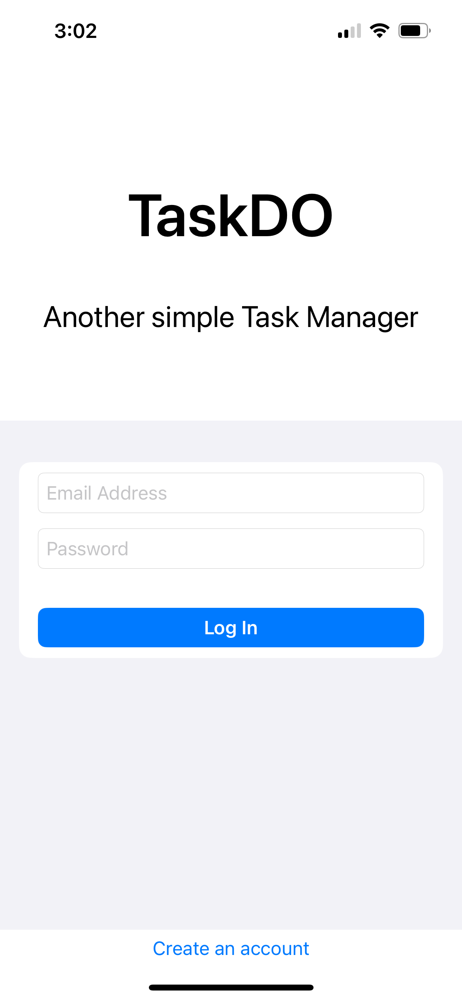
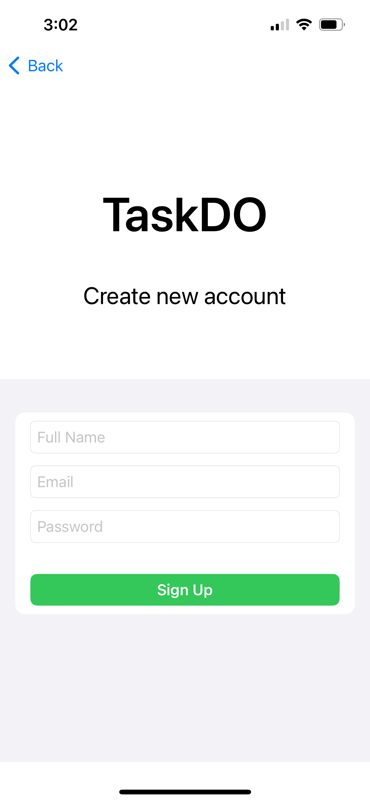
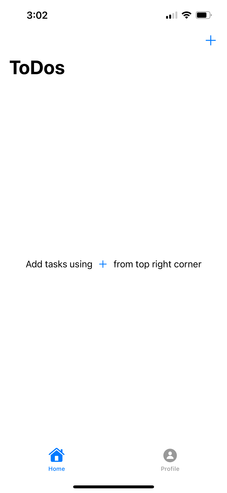
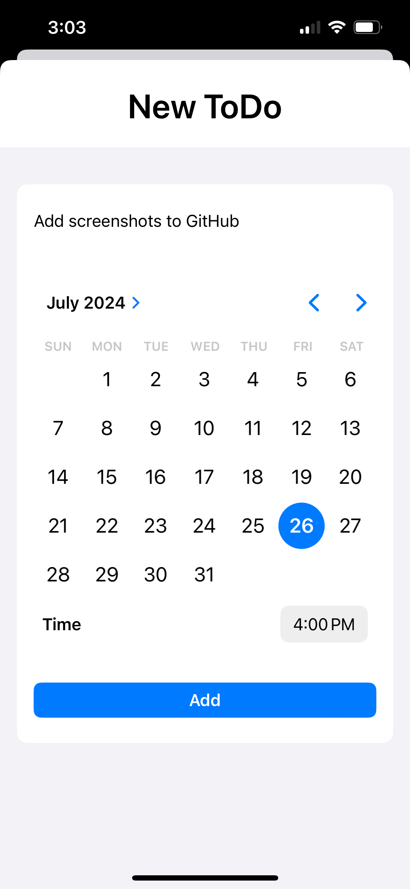
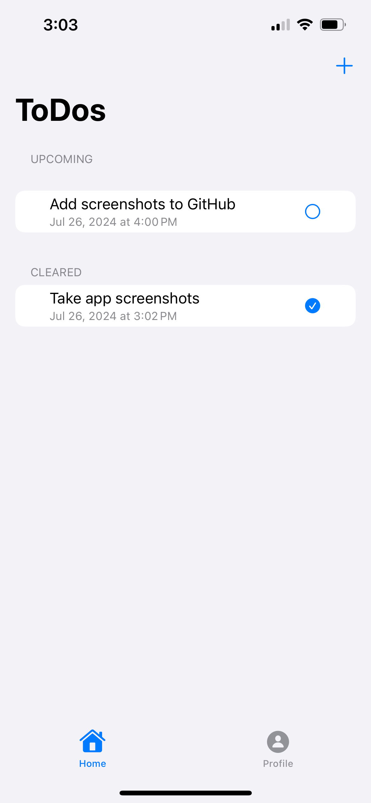
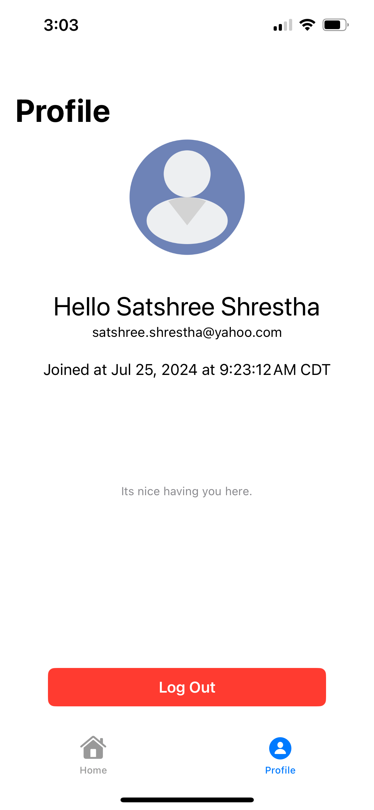

# TaskDO

Another simple task manager.

## Intent

iOS application built with Swift UI.

This is my Hello World to the world of Swift UI and native iOS development. After this, the possibilites are endless.

## Crash Course

Reference crash course I used
👉 [https://www.youtube.com/watch?v=t_mypMqSXNw&t=5014s](https://www.youtube.com/watch?v=t_mypMqSXNw&t=5014s)

## Screenshots

> Login Screen
>
> 

> Sign Up Screen
>
> 

> Home Screen (empty)
>
> 

> Task Form
>
> 

> Home Screen (with tasks)
>
> 

> Profile Page
>
> 
